# 🍔 BurgerCraft — Relatório do Trabalho 2

> Desenvolvimento de Aplicativos Móveis · Kotlin + Jetpack Compose (Material 3)

---

### 1. Como estava o projeto no Trabalho 1 e o que mudou?

* **Antes (Trabalho 1):** o app tinha só 3 telas (`MenuScreen`, `CustomizationScreen` e `CartScreen`), todas montadas com `Column`, `Row` e `Box` e com dados fixos no código. Não existia navegação: a `MainActivity` chamava direto uma única tela (`setContent { CartScreen() }`). A barra inferior era só desenho, uma `Row` com quatro ícones (`ItemBarraNavegacao`) que não levavam a lugar nenhum, e cada tela guardava seu próprio estado com `remember`, sem compartilhar nada com as outras.
* **Agora (Trabalho 2):** o app virou um fluxo completo com **10 telas** ligadas por um único `NavHost` + `NavController`, com todas as rotas centralizadas no objeto `Rotas`. A barra inferior agora é uma `NavigationBar` de verdade (Início · Buscar · Carrinho · Perfil), com contador de itens no carrinho, e só aparece nas abas principais. Os dados saíram das telas e foram para o `BurgerViewModel`, em listas reativas (`mutableStateListOf`) de **Categorias** e **Produtos**, com operações reais de adicionar e remover. Também colocamos login com dois perfis (Administrador cadastra/remove, Cliente só compra) e fotos reais nos produtos.

**Versão atual — tela inicial com a barra inferior funcional:**

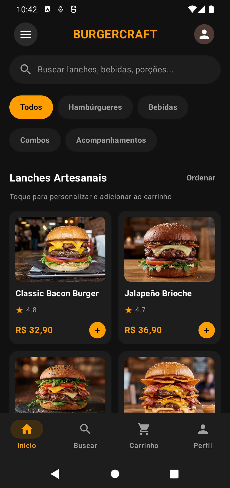

---

### 2. Por que essas telas novas e o que cada uma faz?

A ideia foi cobrir a experiência inteira de pedir numa hamburgueria: entrar, escolher, personalizar, pagar e acompanhar. Ficaram estas telas:

1. **LoginScreen (Entrar):** login em memória com dois perfis de demonstração (`admin / admin123` e `user / 1234`). O perfil define o que aparece no resto do app.
2. **MenuScreen (Cardápio / Início):** lista principal de **Produtos** em `LazyColumn` + `Card` (grade de 2 colunas), com filtro por categoria e opção de ordenar por preço. Tocar abre os detalhes; o administrador remove pela lixeira ou segurando o card (com confirmação).
3. **CategoriasScreen (Categorias):** segunda lista, de **Categorias**, em `LazyColumn` + `Card`, com formulário para adicionar e lixeira para remover. Mostra quantos produtos cada categoria tem.
4. **CustomizationScreen (Detalhes do produto):** recebe o `produtoId` pela rota e mostra foto, descrição, ingredientes, ponto da carne (`RadioButton`), adicionais (`Checkbox`), observação e quantidade, com o preço recalculado na hora.
5. **CategoriaDetalhesScreen (Detalhes da categoria):** recebe o `categoriaId` pela rota e mostra só os produtos daquela categoria, com estatísticas calculadas (quantidade, preço médio e mais barato).
6. **NovoProdutoScreen (Adicionar produto):** formulário com nome, preço (só aceita número), descrição, ícone e categoria. Mostra uma prévia do card enquanto o usuário digita. Só o administrador acessa.
7. **CartScreen (Carrinho):** itens personalizados, alterar quantidade ou remover, endereço, forma de pagamento (Pix, Cartão, Dinheiro), subtotal, taxa de entrega e total.
8. **PedidoScreen (Pedido confirmado):** recebe o número do pedido pela rota e mostra o resumo, o tempo estimado e o total.
9. **BuscaScreen (Buscar):** campo de busca que filtra os produtos pelo nome e pela descrição enquanto o usuário digita; sem texto, mostra atalhos das categorias.
10. **PerfilScreen (Perfil):** edição de nome, endereço e telefone, favoritos, histórico de pedidos e botão de sair.

**Navegação em sequência:**

| Início | Categorias | Detalhes do produto | Detalhes da categoria |
|:--:|:--:|:--:|:--:|
| 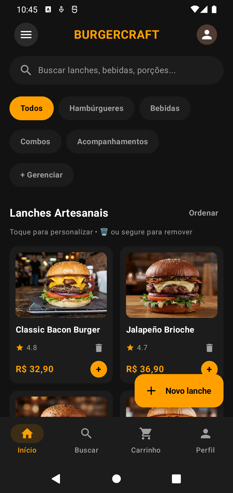 | 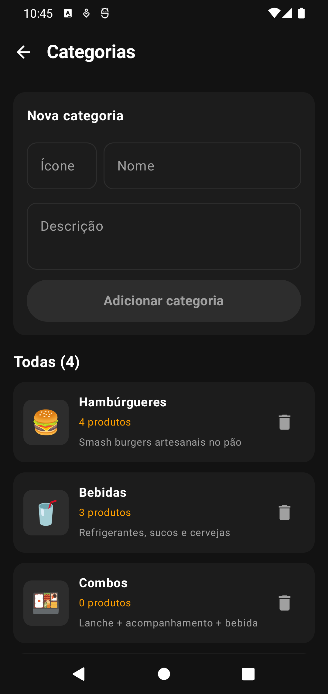 | 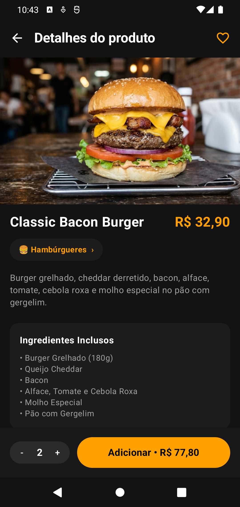 | 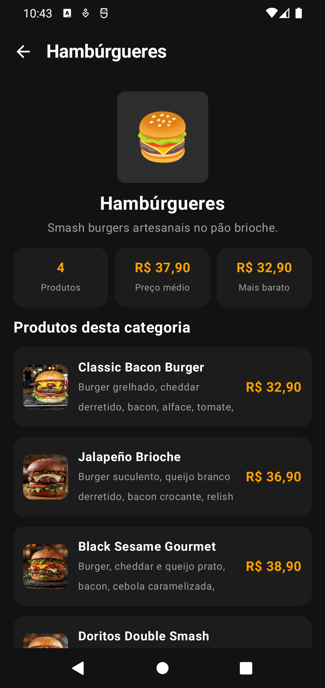 |

| Novo produto | Carrinho | Pedido confirmado | Buscar | Perfil |
|:--:|:--:|:--:|:--:|:--:|
| 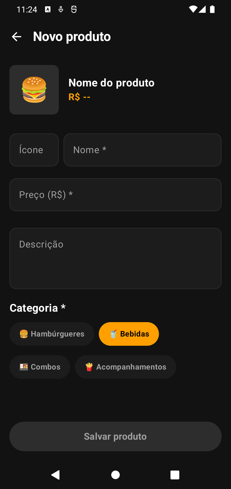 | 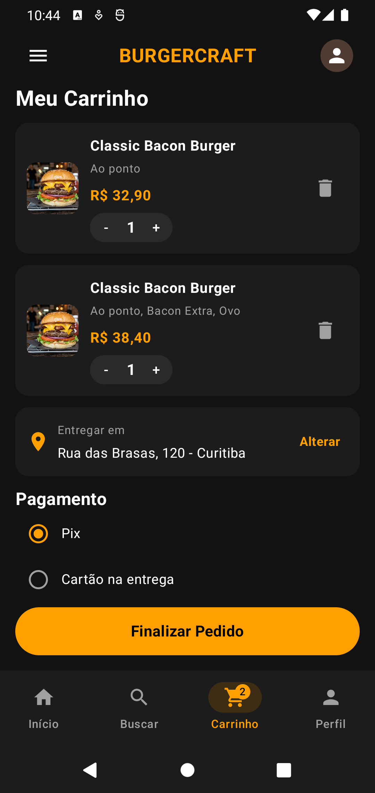 | 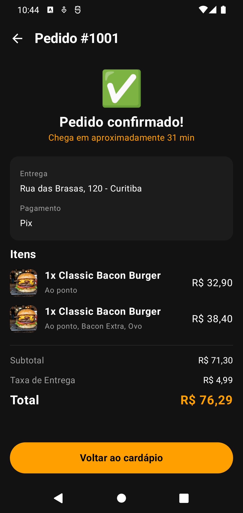 | 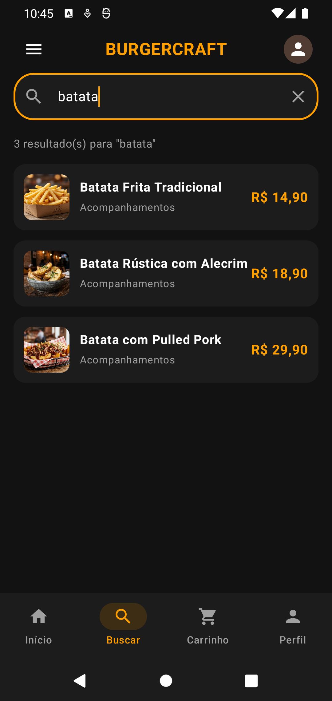 | 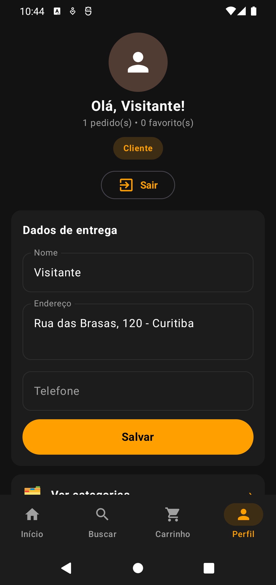 |

---

### 3. Decisões de organização e configuração do código

* **Rotas em arquivo único (`Rotas.kt`):** todas as rotas ficam como constantes num `object Rotas`, junto com funções que montam as rotas com argumento (`Rotas.produto(id)`, `Rotas.categoria(id)`, `Rotas.pedido(numero)`, `Rotas.novoProduto(categoriaId)`). Assim nenhuma tela escreve caminho "na mão" e um erro de digitação vira erro de compilação. A lista `Rotas.abas` diz em quais telas a barra inferior aparece.
* **Estado elevado no ViewModel (State Hoisting):** as listas (`categorias`, `produtos`, `carrinho`, `pedidos`, `favoritos`) ficam no `BurgerViewModel`, que é criado **uma vez** em `AppNavigation` e passado para todas as telas. Por isso, quando um produto é cadastrado ou removido, o cardápio, a busca, as categorias e o carrinho atualizam ao mesmo tempo.
* **Remoção consistente:** ao remover um produto, o ViewModel também tira ele dos favoritos e do carrinho, para nenhuma tela ficar mostrando um item que não existe mais.
* **TopAppBar com voltar:** as telas filhas (detalhes, categorias, novo produto, pedido) usam um componente `BarraTopo` reaproveitável, que chama `navController.popBackStack()`.
* **Troca de abas sem empilhar telas:** criamos a função `irParaAba()` com `popUpTo(INICIO) { saveState = true }`, `launchSingleTop` e `restoreState`. Assim, ficar trocando de aba não enche a pilha de cópias da mesma tela.
* **Componentes reaproveitados (`Componentes.kt`):** cabeçalho, barra de topo, foto do produto, seletor de quantidade, botões e estado vazio são escritos uma vez e usados em várias telas.
* **Dados em memória:** como pede o escopo do trabalho, não usamos banco de dados. Ao fechar o app, tudo volta ao estado inicial.

---

### 4. Complexidade extra na tela de Detalhes

Na tela de detalhes do produto (`CustomizationScreen`) colocamos:

* **Cálculo dinâmico:** o preço do botão "Adicionar" é recalculado em tempo real: `(preço base + soma dos adicionais marcados) × quantidade`. No print abaixo, o Classic Bacon Burger (R$ 32,90) com Bacon Extra (+R$ 3,50) e Cheddar Extra (+R$ 2,50), em 2 unidades, dá **R$ 77,80**.
* **Cruzamento de listas:** a tela usa o `categoriaId` do produto para buscar a categoria na **outra lista** e mostra o nome dela ("🍔 Hambúrgueres ›"). Esse chip é clicável e abre os detalhes da categoria.
* **Item personalizado no carrinho:** o ponto da carne, os adicionais e a observação vão juntos para o carrinho, que mostra o resumo ("Ao ponto, Bacon Extra, Ovo") e soma os valores certos.
* **Favoritar:** o coração na barra de topo adiciona ou tira o produto da lista de favoritos, que aparece no Perfil.

A tela de **detalhes da categoria** também cruza as duas listas: filtra os produtos daquela categoria e calcula a quantidade, o preço médio e o produto mais barato.

| Cálculo com adicionais | Categoria do produto | Estatísticas da categoria |
|:--:|:--:|:--:|
| 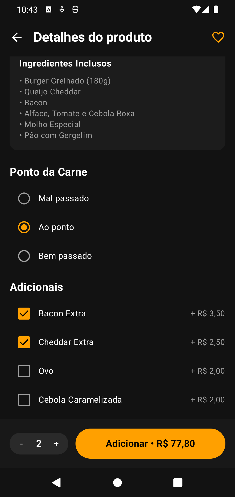 |  |  |

---

### 5. Dificuldades e soluções

* **Argumentos nas rotas:** no começo os detalhes abriam vazios, porque o argumento chegava como texto. *Solução:* nas rotas `produto/{produtoId}`, `categoria/{categoriaId}` e `pedido/{numero}` lemos o argumento e convertemos com `toIntOrNull()`, e depois buscamos o item certo na lista com `.find { it.id == id }`. Na rota de novo produto, que tem argumento opcional, usamos `navArgument("categoriaId") { type = NavType.IntType; defaultValue = -1 }`.
* **Produto removido com a tela aberta:** se o produto fosse apagado, a tela de detalhes quebrava. *Solução:* quando `buscarProduto(id)` devolve `null`, a tela mostra "Produto não encontrado" em vez de travar. Do mesmo jeito, se a categoria filtrada no cardápio for apagada, o filtro volta para "Todos".
* **Atualização da lista ao excluir:** às vezes, depois de remover um item, o card errado sumia. *Solução:* usamos `mutableStateListOf` e passamos `key = { it.id }` nos `items()` das `LazyColumn`.
* **Sobreposição com a barra inferior e o teclado:** o rodapé cobria os últimos cards e o teclado escondia campos. *Solução:* aplicamos o `padding` do `Scaffold` direto no `NavHost` (`Modifier.padding(padding).consumeWindowInsets(padding)`), deixamos espaço extra no fim das listas e usamos `imePadding()` nas telas com formulário.
* **Logout reabrindo telas da sessão anterior:** como as abas salvam estado (`saveState`), ao sair e entrar com outro perfil o app reabria as telas antigas. *Solução:* a função `irParaLogin()` limpa a pilha inteira e chama `clearBackStack()` para cada aba.
* **Categorias cortadas:** com 5 categorias, os chips não cabiam numa linha e "Combos" aparecia cortado, tanto na tela inicial quanto no formulário de novo produto. *Solução:* trocamos a `Row` com rolagem horizontal por um `FlowRow`, que quebra os chips para a linha de baixo.
* **Filtro e escolhas sumindo ao voltar:** ao abrir um produto e voltar, o filtro de categoria do cardápio voltava para "Todos", e os adicionais escolhidos no produto se perdiam ao abrir a categoria e voltar. Isso acontecia porque `remember` perde o valor quando a tela sai da composição. *Solução:* trocamos por `rememberSaveable` (filtro, ordenação, busca, forma de pagamento e campos dos formulários). Para a lista de adicionais usamos um `listSaver`, que salva só os nomes e recria a lista ao voltar.
* **Fotos dos produtos:** no começo os produtos usavam emoji. *Solução:* colocamos as fotos em `res/drawable-nodpi`, criamos o campo `foto` no `Produto` e fizemos o componente `FotoProduto` mostrar a imagem (`painterResource` + `ContentScale.Crop`). Se o produto não tiver foto, como os cadastrados pelo app, ele continua mostrando o emoji.

---

### 6. Testes antes de entregar

Antes de subir no GitHub, testamos no emulador todos os botões do app, com os dois perfis:

* **Login:** senha errada mostra "Usuário ou senha incorretos"; o botão "Mostrar/Ocultar" senha funciona; os dois perfis entram.
* **Lista de Produtos:** cadastrar pelo formulário (inclusive pelo botão "Novo produto" dentro de uma categoria, que já vem com a categoria marcada), aparecer na lista, abrir os detalhes, remover pela lixeira com confirmação ("Cancelar" e "Remover"), filtro por categoria e "Ordenar" por preço.
* **Lista de Categorias:** adicionar, aparecer na lista, abrir os detalhes, remover pela lixeira. Uma categoria que ainda tem produtos não pode ser removida.
* **Detalhes:** cada card abre o item certo; adicionais, quantidade, favoritar e o chip da categoria funcionam; o botão voltar (da barra e do celular) volta para a tela anterior.
* **Carrinho e pedido:** `+`/`-`, lixeira, "Alterar" endereço, forma de pagamento, "Finalizar Pedido", "Voltar ao cardápio" e "Ver cardápio" com o carrinho vazio.
* **Busca e Perfil:** busca com e sem resultado, "Limpar", salvar dados, favoritos, histórico de pedidos (abre o pedido), "Gerenciar categorias" e "Sair".
* **Permissões:** com o perfil Cliente não aparecem lixeiras, "+ Gerenciar", "Novo lanche" nem o formulário de nova categoria.
